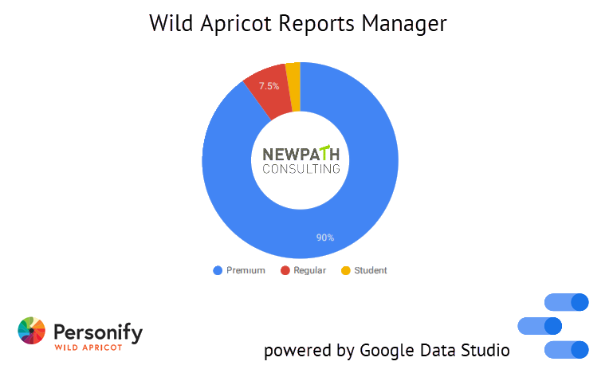

# Documentation

# Project Description

Wild Apricot is the #1 rated Membership Management platform that enables membership-based organizations to manage their contact database and all members transactions with ease. The system has many modules including events, membership renewals, donations and an online store. It also enables administrators to customize their contact and member database. Members and administrators are able to manipulate data such as membership status, event registration, online payments with ease.

The built in reporting system in Wild Apricot does not allow easy summarization and visualization of Wild Apricot member and contact transactions. The comprehensive real-time report capabilities in Google Data Studio are a perfect solution that helps administrators integrate Wild Apricot data with a variety of external analytical systems like Google Ads and Google Analytics. This project is a Google Data Studio community data connector built to retrieve data from Wild Apricot, which can be summarized and transformed in GDS to create user-friendly and real-time dashboard for Wild Apricot.

Data is fetched in real-time, securely using Wild Apricot's REST API.

The code is maintained by [NewPath Consulting](https://www.newpathconsulting.com/warm).

# Features

This community data connector is written in JavaScript and supports the following Wild Apricot data objects.

- [Account](https://gethelp.wildapricot.com/en/articles/506-accounts-admin-api-call)
- [Contacts](https://gethelp.wildapricot.com/en/articles/502-contacts-admin-api-call)
- [Contact custom fields](https://gethelp.wildapricot.com/en/articles/503-contactfields-admin-api-call)
- [Membership Levels](https://gethelp.wildapricot.com/en/articles/496-membershiplevels-admin-api-call)
- [Events](https://gethelp.wildapricot.com/en/articles/499-events-admin-api-call)
- [Event Registrations](https://gethelp.wildapricot.com/en/articles/501-eventregistrations-admin-api-call)
- [Invoices](https://gethelp.wildapricot.com/en/articles/498-invoices-admin-api-call)
- [Invoice Details](https://gethelp.wildapricot.com/en/articles/498-invoices-admin-api-call)
- [Payments](https://gethelp.wildapricot.com/en/articles/494-payments-admin-api-call)
- [Sent emails](https://gethelp.wildapricot.com/en/articles/1606-sentemails-admin-api-call)
- [Auditlog](https://gethelp.wildapricot.com/en/articles/505-auditlogitems-admin-api-call)

# Installation

This is a community connector. This connector has been published as a Partner connector in the [GDS connector repository](https://datastudio.google.com/data?search=wild%20apricot).

To use the connector you can perform one of 2 procedures:

- Create your own Wild Apricot data source with [this connector link](https://datastudio.google.com/datasources/create?connectorId=AKfycbzCDTl62VlYZZd5NIqQ1RFmeUdG71a004N5dGqDyAORuZCQLkcSY2Ygsp4tGgEAbR4W)

or

- Install the code in the /src folder and install it using the [GDS deployment procedures](https://developers.google.com/datastudio/connector/deploy).

After the data source is configured you will be asked for a [Wild Apricot API key](https://gethelp.wildapricot.com/en/articles/484). API keys can be created in the Wild Apricot administrative system under [Settings/Integrations/Authorized Applications](https://gethelp.wildapricot.com/en/articles/180)

## Edit and Use your own copy of the Wild Apricot Reports Manager

1.  Visit [Google Apps Script](https://script.google.com/) and create a new
    project.
1.  In the Apps Script development environment, select **View > Show manifest
    file**. Replace the contents of this file with the content of the
    `src/appsscript.json` file from this repository.
1.  For every `.js` file under `src`, you will need to create a file in Apps
    Scripts (**File > New > Script File**), then copy over the content from the
    repository.
1.  To use the Community Connector in Data Studio, follow the
    [guide on Community Connector Developer site](https://developers.google.com/datastudio/connector/use).

# Sample Dashboard (Google Data Studio)

[Sample Wild Apricot Report in PDF](https://github.com/asirota/gds-wildapricot-connector/blob/master/images/Simple%20Wild%20Apricot%20Report%20in%20Google%20Data%20Studio.pdf)

[Sample Wild Apricot Report in Google Data Studio (live)](https://datastudio.google.com/s/ia1L-H14C4U)

Dashboards can be customized flexibly according to a report writers requirements using one or more data sources.

# References

[Lessons Learned: Building a Google Data Studio Partner Connector](https://www.newpathconsulting.com/2019/09/building-google-data-studio-partner-connector.html)

[GDS Authentication Docs](https://developers.google.com/datastudio/connector/auth)

[GDS Community Connector Docs](https://developers.google.com/datastudio/connector)

[GDS GitHub Repositories and Experiments](https://github.com/googledatastudio)

[Wild Apricot API Documentation](https://gethelp.wildapricot.com/en/articles/182-using-wild-apricots-api)

[Wild Apricot Product Description](https://www.wildapricot.com/membership-management-software)

[Extract data for faster performance in Google Data Studio](https://support.google.com/datastudio/answer/9019969?hl=en)

# Changelog

- v1.0 August 6 2019 - updated the INVOICES, EVENTS and MEMBERS endpoint to support a lot more information (custom fields not yet supported), support Stackdriver logging and global variable to turn off logging, regression tested auditlog and accounts. Added access to Membership Levels .
- v1.1 September 10 2019 - added AccountID to every endpoint to track which Wild Apricot account (eg site) is providing the data. Updated connector manifest file to include the necessary data for publication into partner directory
- v1.1.1 September 13 2019 - added a new config parameter collection screen with API key validation and step-by-step collection of config parameters depending on the end point being used
- v1.2 September 27 2019 - removed auditlog/invoice config parameters in favour of GDS built in date filter control, added error handling to the getData() call, enabled API key override at the report level, added Account Name dimension to Account endpoint, added Auditlog timestamp to auditlog endpoint, modified schema for members end point to make sure balances are in CAD currency and are a METRIC rather than DIMENSION, Google Partner Connector submitted and approved
- v2.0 March 31 2020 - added support for accessing Contact custom fields, Sent Emails, Payments. Added ability to access "pages" of records for Contacts and Contact custom fields, Events, Sent Emails, Invoices, Payments and AuditLog. Contacts can also have an API-level filter applied as well as return just a count of records rather than the full record set. On Contacts and Contact custom fields configuration supports returning only members or to include archived records. Invoices and Sent emails have filters that can be applied as well.
- v2.1 June 19 2020 - added support for Event Registrations and Invoice Details, updated the date field format in all objects to support granularity/show as date display, added User-Agent string to the fetchAPI call to identify WARM calls to Wild Apricot API service ("User-Agent: WARM / 2.1 (xxx) Wild Apricot Reports Manager" where xxx is either PROD, UAT, DEV depending on the version of WARM being used)
